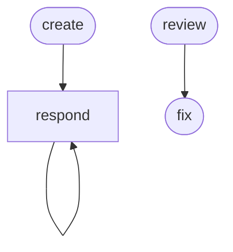

# PR Lifecycle Workflow

A PR lifecycle workflow for multi-repo workspaces — create PRs, review PRs, and respond to review comments across component repositories.

## Invocation

Every phase accepts a component directory and optional PR number:

```
/pr:<phase> <component-dir> [pr-number]
```

Examples:
- `/pr:create osac-operator` — validate and create a PR from osac-operator
- `/pr:review osac-operator` — review the PR on osac-operator's current branch
- `/pr:review osac-operator 56` — review PR #56 in osac-operator
- `/pr:respond fulfillment-service` — respond to comments on your PR
- `/pr:fix fulfillment-service` — apply fixes for review findings

## Phase Flow



**Author flow:** `create → respond → [respond loop]`

**Self-review flow:** `review → fix → [push changes]`

**Reviewer flow:** `review`

## Prerequisites

| Tool | Required | Purpose |
|------|----------|---------|
| GitHub CLI (`gh`) | Yes | PR creation, fetching comments, posting replies |
| `gh pr-review` extension | For `/respond` | Fetch inline code review comments |
| Git | Yes | Branch management, worktrees |
| `fork` remote | For `/create` | Fork-based push target |

## Phases

| Phase | Command | Purpose | Artifact |
|-------|---------|---------|----------|
| Create | `/create` | Validate, push, and open a PR | PR on GitHub |
| Review | `/review` | Review a PR in a temp worktree | `03-review-findings.md` |
| Respond | `/respond` | Ingest and address review comments | `01-review-comments.md`, `02-response-log.md` |
| Fix | `/fix` | Apply code fixes for review findings | Updates `03-review-findings.md` |

## Typical Flow

```text
/pr:create osac-operator
  → runs repo-specific validation (make fmt, lint, build, test)
  → pushes to fork remote
  → creates PR against origin/main
  → reports PR URL

/pr:review osac-operator 56
  → checks out PR #56 into .artifacts/pr/osac-operator#56/worktree
  → reviews against repo conventions and review protocol
  → writes findings to .artifacts/pr/osac-operator#56/03-review-findings.md
  → optionally posts review comments (with user approval)
  → cleans up worktree

/pr:respond fulfillment-service
  → detects PR from current branch
  → fetches inline + discussion comments
  → categorizes each (code fix, clarification, nit, etc.)
  → proposes responses (user approves before posting)
  → makes code changes and posts replies
  → writes response log
  → repeatable

/pr:fix fulfillment-service
  → reads findings from .artifacts/pr/fulfillment-service#728/03-review-findings.md
  → presents findings by severity
  → proposes code fix for each (user approves before applying)
  → runs build/tests after each fix
  → marks findings as [FIXED] in the artifact
```

## Artifacts

All artifacts are stored in `.artifacts/pr/{component}#{pr-number}/`.

## Directory Structure

```text
pr/
├── SKILL.md                    # Workflow entry point
├── guidelines.md               # Behavioral rules and guardrails
├── README.md                   # This file
├── skills/
│   ├── controller.md           # Phase dispatcher and transitions
│   ├── create.md               # Validate, push, open PR
│   ├── review.md               # Review PR in temp worktree
│   ├── respond.md              # Ingest and address review comments
│   └── fix.md                  # Apply code fixes for review findings
└── commands/
    ├── create.md               # /create command
    ├── review.md               # /review command
    ├── respond.md              # /respond command
    └── fix.md                  # /fix command
```

## Getting Started

```bash
# Install the workflow
./install.sh claude --workflows pr

# Or install all workflows
./install.sh all
```

Then from the workspace root, run `/pr:create <component>` to create a PR
or `/pr:review <component> [pr-number]` to review one.
